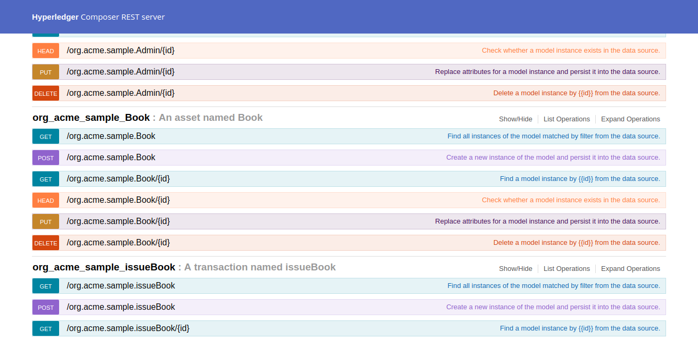

# BookChain
### A Rest-API serving as a back-end for library management system based on blockchain

## Features
<ul>
  <h3>
  <li>IOT based library management </li>
  <li>Blockchain based </li>
  <li> Peer to Peer book transfer </li>
  </h3>
</ul>
 
